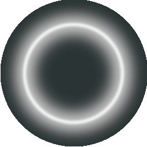

<h1 align="center">Halo Network</h1>
 

 

Halo Network is a DLT based solution built to secure and share you personal data. It is part of the Industrial PhD funded by Marche Region, won by Gioele Bigini. The PhD is a joint initiative of the University of Urbino, Politecnica delle Marche and TU Wien and the company Digit Srl.

# Authors:
- Gioele Bigini, PhD Student @ University of Urbino
